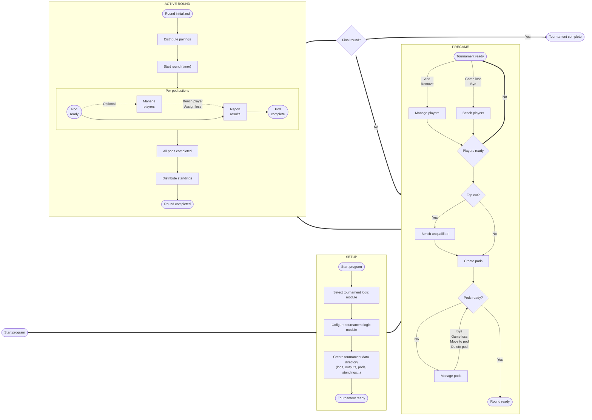

```mermaid

    flowchart LR

    subgraph sub_A[SETUP]
        direction TB

        %% VARIABLES
        A1([Start program])
        A2[Select tournament logic module]
        A3[Cofigure tournament logic module]
        A4["Create tournament data directory\n(logs, outputs, pods, standings...)"]
        AE([Tournament ready])

        %% CONNECTIONS
        A1 --> A2 --> A3 --> A4 --> AE
    end

    subgraph sub_B[PREGAME]
        direction TB

        %% VARIABLES
        B0([Tournament ready])
        BT0{Top cut?}
        BT1[Bench unqualified]
        B1[Manage players]
        B2[Bench players]
        B3{Players ready}
        B4[Create pods]
        B5{Pods ready?}
        B6[Manage pods]
        BE([Round ready])

        %% CONNECTIONS
        B0 --> |Add\nRemove| B1 --> B3
        B0 --> |Game loss\nBye| B2 --> B3
        B3 ====> |No| B0

        B4 --> B5
        B5 --> |No| B6
        B6 ---> |Bye\nGame loss\nMove to pod\nDelete pod| B5

        B5 ----> |Yes| BE

        B3 --> BT0 --> |Yes| BT1 --> B4
        BT0 --> |No| B4
    end

    subgraph sub_C[ACTIVE ROUND]
        direction TB

        %% VARIABLES
        C1([Round initialized])
        C2[Distribute pairings]
        C3["Start round (timer)"]
        C5[All pods completed]
        C6[Distribute standings]
        CE([Round completed])

        %% ACTIONS WITHIN ROUND
        subgraph sub_C4[Per pod actions]
            direction LR

            C4_0([Pod\nready])
            C4_1[Manage\nplayers]
            C4_2[Report\nresults]
            C4_E([Pod\ncomplete])

            C4_0 -..-> |Optional|C4_1 -..-> |Bench player\nAssign loss|C4_2
            C4_0 --> C4_2

            C4_2 --> C4_E
        end

        %% CONNECTIONS
        C1 --> C2 --> C3 --> sub_C4 --> C5 --> C6 --> CE
    end

    outer_0([Start program])
    outer_1{Final round?}
    outer_E([Tournament complete])

    outer_0 ====> sub_A
    sub_A ==> sub_B ==> sub_C ==> outer_1
    outer_1 ==> |No| sub_B
    outer_1 ====> |Yes| outer_E

```